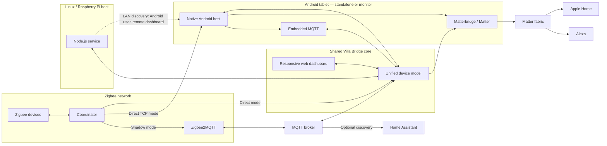

# Villa Bridge

### One friendly dashboard for your whole smart home.

[](https://nodejs.org/)
[](LICENSE)

Villa Bridge brings Zigbee devices, Matter systems and Home Assistant into one
clear, mobile-first control panel. It hides protocol names, MQTT topics and
endpoint details so the people using the home only see familiar device names
and simple controls.

The project is designed for households that want the flexibility of an open
smart-home stack without making every family member become a home-automation
expert.

## See Villa Bridge in action

The same dashboard adapts from a full desktop control centre to a compact,
touch-friendly mobile view.


<p align="center">
  
</p>

> **Android alpha available:** the native tablet APK has been validated on a
> Nokia T10 as a standalone host for the dashboard, embedded local MQTT, direct
> TCP Zigbee core, and Matterbridge/Matter. It does not require a Raspberry Pi.
> See the [Android alpha guide](apps/android/README.md) for its tested scope,
> installation steps, and current limitations.
>
> **Linux/Pi alpha:** Debian 12 and 64-bit Raspberry Pi hosts use the same
> core and standalone runtime under `systemd`. See the
> [Linux and Raspberry Pi guide](apps/linux/README.md).

## What makes it useful

- **One name everywhere.** A device keeps its UID internally while its friendly
  name is shared with Matter, Alexa, Apple Home and Home Assistant.
- **Everyday controls first.** Pin a complete device or an individual channel to
  Home, then switch it with one tap.
- **Lights that feel natural.** Control power, brightness, colour temperature
  and supported RGB colours from a touch-friendly panel.
- **No protocol hunting.** Add or remove Zigbee devices, inspect signal quality,
  create a Matter pairing code and manage connections in the same interface.
- **Made for real homes.** Responsive grid/list views, English and Turkish
  language support, plus an Android tablet alpha and the original Linux/Pi
  deployment path.

## How it fits together



In **direct mode**, Villa Bridge owns the Zigbee coordinator and provides MQTT
compatibility. In **shadow mode**, Zigbee2MQTT remains in charge and Villa
Bridge follows its device state through the MQTT broker. Matterbridge publishes
the same devices into Matter for Alexa and Apple Home, while Home Assistant
discovery stays optional.

Zigbee remains the source of truth in both modes. Low-level actions use
immutable device UIDs; friendly names are presentation data and can change
safely.

Android, Linux, and Raspberry Pi are built from one `main` branch. The shared
runtime lives in `apps/runtime`; platform folders contain only host-specific
launching, packaging, and lifecycle code.

## Install it on a home server

This is the path for running Villa Bridge in a house, on a Debian machine, an
LXC container or a Raspberry Pi:

```sh
git clone https://github.com/drascom/Villa-Bridge.git /opt/Villa-Bridge
sudo /opt/Villa-Bridge/apps/linux/install.sh
```

Then open `http://<host-ip>:8091` and finish the setup in the dashboard wizard.
No configuration file has to be edited by hand: the first start generates its
own configuration, including a Zigbee network key that is unique to your
installation, and Villa Bridge connects to no coordinator until you enter the
coordinator address in the wizard. Full details, including how to join an
**existing** Zigbee network instead of forming a new one, are in the
[Linux and Raspberry Pi guide](apps/linux/README.md). On an Android tablet the
same setup happens entirely in the app; see the
[Android alpha guide](apps/android/README.md).

Home Assistant users can open **Connections**, copy the displayed MQTT details
and enable discovery when ready. Discovery is off by default.

## Develop on your own machine

This is the path for working on the code, not for running a house. It starts the
core alone, without the installer, the service account or the systemd unit.

```sh
git clone https://github.com/drascom/Villa-Bridge.git
cd Villa-Bridge
npm ci
npm run dev
```

Open `http://localhost:8091`. `npm run dev` reads `config/default.yaml`, which
is in shadow mode: it needs an MQTT broker and an existing Zigbee2MQTT install
to observe. Review that file before pointing it at a real system, and run
`npm test` (build plus the structural gate) before submitting changes.

## Add a language

Dashboard translations are independent JSON packages in `public/locales/`.
Copy `en.json`, rename it with a language code such as `de.json`, then update
its `code`, native `name`, and every value under `translations`. Villa Bridge
discovers valid language files at runtime and adds them to the language switch;
no HTML or TypeScript change is required. Keep the same translation keys as the
English package and run `npm test` before submitting the new language.

## Appearance

The dashboard offers **Light**, **Dark**, and **System** appearance modes from
the top bar. The selection is stored on the device. System mode follows the
operating-system theme and updates immediately when it changes.

## Project status

Villa Bridge is under active development. Shadow mode observes an existing
Zigbee2MQTT network. Direct mode takes ownership of the coordinator and is for
experienced installers; never run two coordinator owners at once and always
back up Zigbee network data first.

The Android build is an alpha validated on a Nokia T10. It can host the local
MQTT broker, direct TCP Zigbee core, Matterbridge/Matter services, and dashboard
without a separate server. If a Villa Bridge Linux/Raspberry Pi host is found
and verified on the LAN, Android automatically becomes a dashboard-only monitor
and leaves the service stack disabled. This validation is device-specific and
is not yet a general production-readiness claim.

## Contributing

Ideas, device reports and pull requests are welcome. Read
[AGENTS.md](AGENTS.md), run `npm test`, and include screenshots for visible UI
changes. Please never commit network keys, MQTT credentials or access tokens.

Licensed under the [Apache License 2.0](LICENSE).
