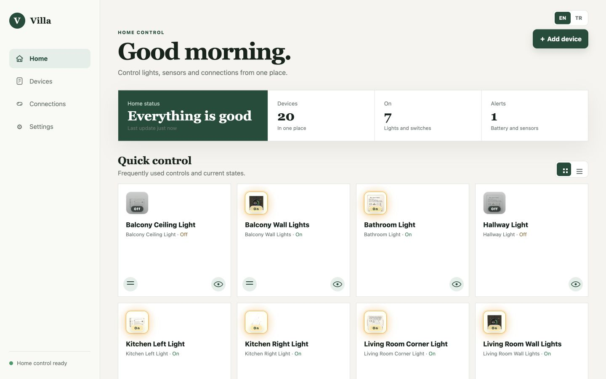
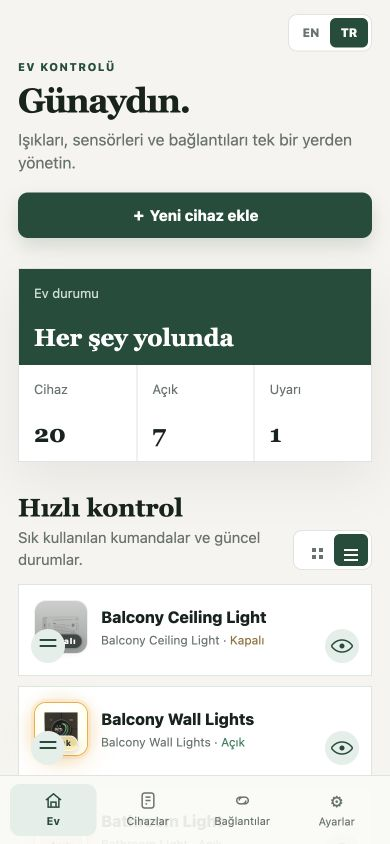
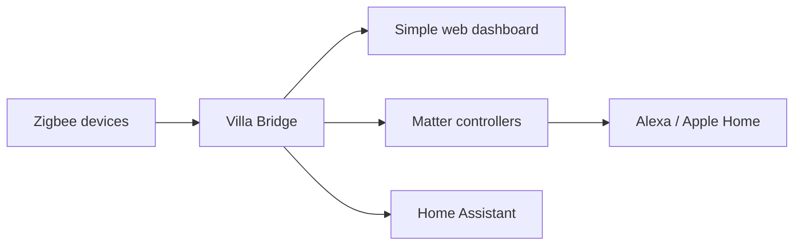

# Villa Bridge

### One friendly dashboard for your whole smart home.

[](https://nodejs.org/)
[](LICENSE)

Villa Bridge brings Zigbee devices, Matter systems and Home Assistant into one
clear, mobile-first control panel. It hides protocol names, MQTT topics and
endpoint details so the people using the home only see familiar device names
and simple controls.

The project is designed for households that want the flexibility of an open
smart-home stack without making every family member become a home-automation
expert.

## See Villa Bridge in action

The same dashboard adapts from a full desktop control centre to a compact,
touch-friendly mobile view.



<p align="center">
  
</p>

## What makes it useful

- **One name everywhere.** A device keeps its UID internally while its friendly
  name is shared with Matter, Alexa, Apple Home and Home Assistant.
- **Everyday controls first.** Pin a complete device or an individual channel to
  Home, then switch it with one tap.
- **Lights that feel natural.** Control power, brightness, colour temperature
  and supported RGB colours from a touch-friendly panel.
- **No protocol hunting.** Add or remove Zigbee devices, inspect signal quality,
  create a Matter pairing code and manage connections in the same interface.
- **Made for real homes.** Responsive grid/list views, English and Turkish
  language support, and a layout ready to become an Android app.

## How it fits together



Zigbee remains the source of truth. Low-level actions use immutable device UIDs;
friendly names are presentation data and can change safely.

## Try it locally

You need Node.js 22+, an MQTT broker and an existing Zigbee2MQTT installation
for the default shadow mode.

```sh
git clone https://github.com/drascom/Villa-Bridge.git
cd Villa-Bridge
npm ci
npm run dev
```

Open `http://localhost:8091`. Review `config/default.yaml` before connecting a
real system. Matterbridge is optional unless you want Alexa or Apple Home
pairing.

Home Assistant users can open **Connections**, copy the displayed MQTT details
and enable discovery when ready. Discovery is off by default.

## Project status

Villa Bridge is under active development. Shadow mode observes an existing
Zigbee2MQTT network. Direct mode takes ownership of the coordinator and is for
experienced installers; never run two coordinator owners at once and always
back up Zigbee network data first.

## Contributing

Ideas, device reports and pull requests are welcome. Read
[AGENTS.md](AGENTS.md), run `npm test`, and include screenshots for visible UI
changes. Please never commit network keys, MQTT credentials or access tokens.

Licensed under the [Apache License 2.0](LICENSE).
