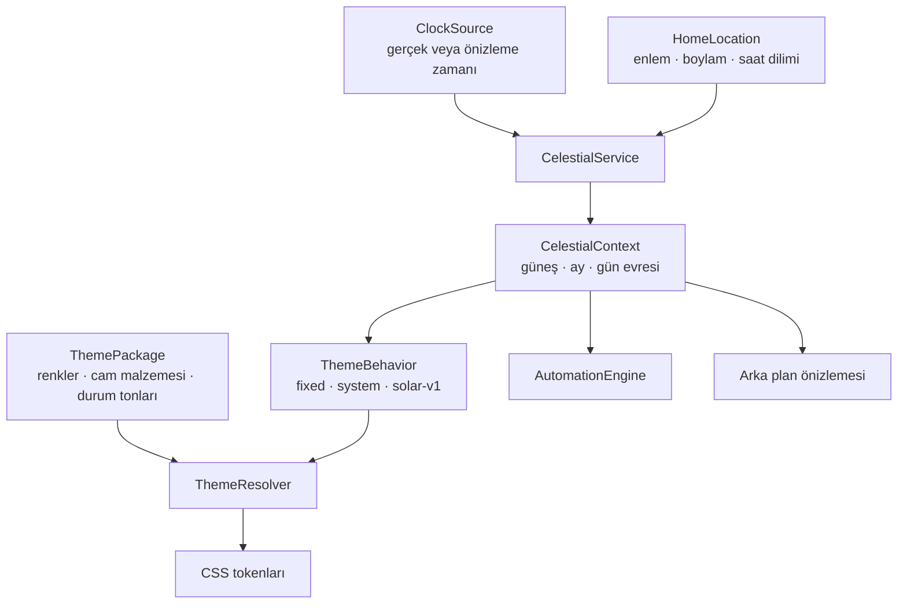

# Villa Bridge Modüler Tema ve Yerel Astronomi Sistemi — Uygulama Planı

## 1. Amaç

Bu çalışma üç hedefi birlikte çözer:

1. `Light`, `Dark`, `System` ve `By the Sun` davranışlarını görünüm paketlerinden ayırmak.
2. Güneş ve ay verilerini internet ya da hava durumu servisine bağlı olmadan, evin konumu ve yerel zamanı üzerinden hesaplamak.
3. Kullanıcının güvenli biçimde tema paketi seçebilmesini ve Light, Dark ve By the Sun paletlerini değiştirebilmesini sağlamak.

Tasarım referansı: [Light, Dark ve By the Sun önizlemesi](./villa-theme-preview.html)

Bu önizleme üretim kodu değildir. Renk ailesi, cam yüzey hiyerarşisi, açık/kapalı cihaz durumları ve mevcut tablet yerleşimi için kabul referansıdır.

## Uygulama durumu — `feature/modular-solar-theme`

Bu planın çalışan ilk sürümü ayrı özellik dalında uygulanmıştır; `main` değiştirilmemiştir.

Tamamlanan çekirdek kapsam:

- IANA saat dilimli `HomeLocation` v2 ve eski konum kayıtları için doğrulama uyarısı;
- ortak, bağımlılıksız güneş/ay hesaplama motoru ve seçilmiş önizleme zamanı destekli `/api/celestial`;
- otomasyon saat/gün karşılaştırmalarının ev konumunun saat dilimine bağlanması;
- doğrulanan `villa-current` ve `villa-liquid-glass` JSON tema paketleri;
- sunucuda atomik saklanan Light, Dark ve dört solar durak renk özelleştirmeleri;
- paket runtime'ı, ilk-kare önbelleği ve gerçek güneş yüksekliğine göre solar renk geçişi;
- gerçek ay konumu/ufuk görünürlüğü;
- kartlardan ayrı grid satırında, tam genişlikte alt hızlı erişim barı;
- `1024×640` yerleşim akışı, astronomi ve tema paketlerini `npm test` kapısında koruyan denetimler.

Sonraki genişletme kapsamı: kullanıcı tema paketi içe/dışa aktarma, gelişmiş malzeme kontrolleri ve otomatik kontrast uyarılarıdır. Bunlar çekirdek paket seçimi, renk düzenleme veya By the Sun davranışı için gerekli değildir.

## 2. Temel mimari kararı

Tema paketi yalnızca **nasıl görüneceğini**, sistem davranışı ise **hangi anda hangi durumda olduğunu** belirleyecek.



Bu ayrım sayesinde:

- Light ve Dark sabit kalır; astronomi motoruna ihtiyaç duymaz.
- System, işletim sistemi tercihine göre Light veya Dark paketini kullanır.
- By the Sun, aynı astronomi bağlamını hem arka plan hem cam yüzeyler için kullanır.
- Otomasyonlar ve arayüz aynı gün doğumu/gün batımı hesabını paylaşır.
- Tema paketleri JavaScript çalıştıramaz ve sistem davranışını değiştiremez.

## 3. Mevcut durum ve çözülmesi gereken ayrışmalar

### 3.1 Mevcut güçlü taraflar

- `src/sun.ts`, tarih + enlem + boylamdan gün doğumu ve batımını yerel olarak hesaplıyor.
- `src/location.ts`, ev konumunu `location.json` içinde atomik olarak saklıyor.
- Otomasyon motoru güneş tetikleyicilerini yerel hesapla çalıştırıyor.
- Panelde `data-theme` ve `data-sky` iki ayrı eksen olarak kullanılıyor.
- Görsel yüzeylerin çoğu `--glass-*` token ailesine bağlanmış durumda.
- By the Sun önizleme saati gerçek sistem zamanını veya otomasyonları değiştirmiyor.

### 3.2 Mevcut sorunlar

- Panelin By the Sun görünümü gün doğumu/batımını hava durumu yanıtından okuyor; otomasyon motoru ise `src/sun.ts` kullanıyor.
- Panelin hava durumu verisi olmadığında kullandığı yaklaşık güneş hesabı boylamı ve saat dilimini hesaba katmıyor.
- `HomeLocation` yalnız `latitude`, `longitude` ve `label` tutuyor; IANA saat dilimi saklanmıyor.
- Konum araması `timeZone` döndürüyor, fakat ev konumu kaydedilirken bu alan atılıyor.
- Ay evresi takvimsel olarak hesaplanıyor fakat ayın gökyüzündeki konumu dekoratif bir gece yayı.
- Tema renkleri merkezî tokenlarla yazılmış olsa da `panel.css` içinde büyük, tek parça ve paketlenebilir olmayan bloklar halinde.
- Aktif tema modu ve gökyüzü ayarları `localStorage` içinde; doğrulanmış bir tema paketi sözleşmesi yok.

## 4. Hedef bileşenler

### 4.1 `HomeLocation` v2

Önerilen veri modeli:

```ts
interface HomeLocation {
  latitude: number;
  longitude: number;
  timeZone: string;
  label?: string;
}
```

Kurallar:

- `timeZone`, `Europe/London` gibi geçerli bir IANA saat dilimi olmalı.
- Doğrulama `Intl.DateTimeFormat("en", { timeZone })` ile yapılmalı.
- Şehir aramasından seçim yapılırsa `timeZone` doğrudan arama sonucundan taşınmalı.
- Hava durumu konumu ev konumu olarak kullanılırsa saat dilimi de taşınmalı.
- Elle koordinat girilirse kullanıcı saat dilimini ayrıca seçmeli; boylamdan saat dilimi tahmin edilmemeli.
- Yapılandırmaya `location.timeZone` ve `VILLA_BRIDGE_TIME_ZONE` desteği eklenmeli.

Eski `location.json` göçü:

1. Kayıtta `timeZone` varsa kullan.
2. Aynı koordinatlara sahip hava durumu konumunda saat dilimi varsa onu kullan.
3. `VILLA_BRIDGE_TIME_ZONE` veya YAML değeri varsa kullan.
4. Son çare olarak sunucunun `Intl.DateTimeFormat().resolvedOptions().timeZone` değerini geçici kaynak olarak kullan.
5. Ayarlar ekranında “Saat dilimini doğrulayın” uyarısı göster; ilk yönetici kaydında v2 biçiminde yaz.

### 4.2 `ClockSource`

Tek zaman sözleşmesi:

```ts
interface ClockSource {
  now(): Date;
}
```

Üretimde `SystemClock` kullanılır. Önizleme isteklerinde kalıcı olmayan bir `FixedClock` veya doğrudan `at` parametresi kullanılır.

Kurallar:

- Canlı tema için doğru kaynak Villa Bridge sunucusunun saatidir.
- Gösterilen yerel gün ve saat `HomeLocation.timeZone` ile biçimlendirilir.
- Önizleme saati yalnız astronomi/tema bağlamını değiştirir.
- Önizleme saati alarm, otomasyon, cihaz geçmişi ve sistem saatini değiştirmez.
- Geçersiz veya aşırı uzak önizleme tarihleri reddedilir; önerilen sınır bugünden ±2 yıl.

### 4.3 `astronomy.ts`

Yeni saf modül:

```ts
interface HorizontalPosition {
  altitudeDegrees: number;
  azimuthDegrees: number;
}

interface SolarDay {
  sunrise: Date | null;
  solarNoon: Date;
  sunset: Date | null;
  state: "normal" | "polar-day" | "polar-night";
}

interface LunarState {
  phase: number;
  illumination: number;
  position: HorizontalPosition;
}
```

Sağlayacağı saf fonksiyonlar:

- `solarPosition(at, latitude, longitude)`
- `solarDay(at, latitude, longitude, timeZone)`
- `lunarPosition(at, latitude, longitude)`
- `lunarIllumination(at)`
- `celestialSnapshot(at, location)`

Uygulama kararı:

- Mevcut SunCalc kökenli formüller genişletilecek; yeni çalışma zamanı bağımlılığı eklenmeyecek.
- Kaynak ve lisans notları dosyada korunacak.
- `src/sun.ts` ilk aşamada uyumluluk cephesi olarak kalacak ve `sunTimes` çağrılarını yeni motora yönlendirecek.
- Otomasyon motorunun dış sözleşmesi ilk refaktörde değişmeyecek.

Ay davranışı:

- Ay evresi ve aydınlanması tarihten hesaplanacak.
- Ay yüksekliği ve yönü tarih + saat + konumdan hesaplanacak.
- Ay ufkun altındaysa çizilmeyecek.
- Ay gündüz ufkun üstündeyse tema paketi izin verdiği ölçüde düşük kontrastla gösterilebilecek.
- “Gece yarısında tepeye çıkan dekoratif yay” kaldırılacak.

Kutup bölgeleri:

- Gün doğumu veya batımı olmaması hata sayılmayacak.
- Güneş yüksekliği kesintisiz hesaplandığı için polar day/polar night teması doğal olarak çalışacak.
- Eski `06:30 / 20:30` dekoratif yedeği yalnız konum tamamen yoksa kullanılabilecek; arayüz bunun yedek olduğunu bildirecek.

### 4.4 `CelestialService`

Yeni durum ve önbellek katmanı:

```ts
interface CelestialContext {
  at: string;
  localDate: string;
  localTime: string;
  timeZone: string;
  location: HomeLocation | null;
  sun: {
    position: HorizontalPosition | null;
    sunrise: string | null;
    solarNoon: string | null;
    sunset: string | null;
    state: "normal" | "polar-day" | "polar-night" | "location-missing";
  };
  moon: {
    position: HorizontalPosition | null;
    phase: number;
    illumination: number;
    aboveHorizon: boolean;
  };
}
```

Sorumluluklar:

- Konum ve saat kaynağını bir araya getirmek.
- Yerel gün + konum + saat dilimi anahtarıyla günlük güneş olaylarını önbelleğe almak.
- Anlık güneş/ay konumunu istek anında hesaplamak.
- Otomasyon motoru ve HTTP API için aynı sonucu sağlamak.
- Konum değiştiğinde önbelleği temizlemek.

### 4.5 Tema davranışları

Sistem tarafından sağlanan davranış kimlikleri:

- `fixed-light-v1`
- `fixed-dark-v1`
- `system-v1`
- `solar-v1`

`solar-v1` girdileri:

- güneş yüksekliği ve yönü;
- güneş doğuyor mu, batıyor mu bilgisi;
- ay yüksekliği, yönü, evresi ve aydınlanması;
- gerçek veya önizleme zamanı.

`solar-v1` çıktıları:

```ts
interface SolarThemeState {
  phase: "night" | "dawn" | "day" | "dusk";
  weights: {
    night: number;
    dawn: number;
    day: number;
    dusk: number;
  };
  luminance: number;
  warmth: number;
  sunVisible: boolean;
  sunTrack: number;
  moonVisible: boolean;
  moonTrack: number;
}
```

Önemli fark: evre ağırlıkları yalnız saat aralıklarından değil, güneş yüksekliğinden üretilecek. Güneşin doğu/batı yönü dawn ile dusk ayrımını belirleyecek.

Önerilen başlangıç eşikleri:

- `altitude <= -12°`: gece
- `-12° .. -0.833°`: astronomik/mavi alacakaranlık
- `-0.833° .. 8°`: gün doğumu veya gün batımı sıcak bandı
- `> 8°`: gündüz
- öğle sıcaklığı: günlük azami güneş yüksekliğine göre normalize edilmiş hafif vurgu

Bu değerler davranış sürümü içindedir; tema paketi eşikleri değiştirmez, yalnız bu ağırlıklara karşılık gelen renkleri tanımlar.

## 5. Tema paketi sözleşmesi

Tema paketleri JSON veri dosyaları olacak; JavaScript, HTML, uzak URL veya serbest CSS içeremeyecek.

Önerilen dizin:

```text
public/themes/
  villa-current/
    theme.json
  villa-liquid-glass/
    theme.json
```

Önerilen `theme.json` v1:

```json
{
  "schemaVersion": 1,
  "id": "villa-liquid-glass",
  "name": "Villa Liquid Glass",
  "author": "Villa Bridge",
  "behaviors": {
    "light": "fixed-light-v1",
    "dark": "fixed-dark-v1",
    "system": "system-v1",
    "sun": "solar-v1"
  },
  "palettes": {
    "light": {
      "colors": {},
      "materials": {}
    },
    "dark": {
      "colors": {},
      "materials": {}
    },
    "solar": {
      "anchors": {
        "night": {},
        "dawn": {},
        "day": {},
        "dusk": {}
      }
    }
  }
}
```

### 5.1 İzin verilen token grupları

Renkler:

- sayfa/gökyüzü üst ve alt renkleri;
- ana ve ikincil yazı;
- cam kart, döşeme ve navigasyon dolguları;
- cam kenarı ve üst ışık çizgisi;
- vurgu, açık cihaz, uyarı ve çevrimdışı durumları;
- güneş, ay, yıldız ve dağ renkleri.

Malzeme sayıları:

- cam opaklığı `0..1`;
- bulanıklık `0..30px`;
- doygunluk `0.5..2`;
- parlaklık `0.5..1.5`;
- kenar opaklığı `0..1`;
- gölge yoğunluğu `0..1`.

Güvenlik kuralları:

- Bilinmeyen anahtar reddedilecek.
- Renkler ayrıştırılıp normalize edilecek; ham CSS ifadesi saklanmayacak.
- `url()`, `var()`, `calc()`, `expression`, `@import` ve benzeri serbest CSS kabul edilmeyecek.
- Gölge için serbest metin yerine sistem tarafından tanımlı `none`, `soft`, `floating` gibi profiller kullanılacak.
- Paket boyutu önerilen en fazla 64 KB olacak.

### 5.2 Yerleşik paketler

İki paket birlikte gönderilecek:

1. `villa-current`: mevcut görünümü mümkün olduğunca birebir koruyan geri dönüş paketi.
2. `villa-liquid-glass`: kaydedilen tasarım önizlemesini temel alan yeni paket.

Yeni kurulumlar için önerilen varsayılan `villa-liquid-glass`; mevcut kurulumlar göç sırasında `villa-current` üzerinde kalır. Böylece güncelleme sonrası beklenmedik görünüm değişikliği olmaz.

## 6. Tema çözümleme ve CSS uygulaması

### 6.1 Semantik token katmanı

`panel.css` içindeki bileşen kuralları yalnız semantik tokenları okuyacak:

```css
--theme-page;
--theme-ink;
--theme-ink-soft;
--theme-glass-card;
--theme-glass-tile;
--theme-glass-nav;
--theme-glass-edge;
--theme-glass-sheen;
--theme-state-on;
--theme-state-active;
--theme-state-alert;
--theme-state-offline;
```

Geçiş döneminde mevcut `--glass-*` adları yeni tokenlara bağlanan uyumluluk alias'ları olarak kalacak. Bileşen kuralları tek seferde topluca yeniden yazılmayacak.

### 6.2 Solar palet enterpolasyonu

- Paket dört renk durağı sağlar: night, dawn, day, dusk.
- `solar-v1` bu durakların ağırlıklarını üretir.
- `ThemeResolver`, RGBA kanallarını JavaScript içinde karıştırıp hazır renk dizgileri üretir.
- Eski Android WebView uyumluluğu için üretim CSS'inde `color-mix()` kullanılmaz.
- Yalnız değişen tokenlar kök elemente yazılır.
- Canlı modda normal güncelleme dakikada bir; CSS geçiş süresi 60 saniye olur.
- Önizleme sürüklenirken geçiş 100–180 ms aralığına iner.

### 6.3 İlk kare ve önbellek

Tema yanıp sönmesini önlemek için:

- `index.html` başlık betiği `villa-appearance-cache-v2` kaydını okur.
- Kayıt yalnız doğrulanmış, çözülmüş tokenları ve konum imzasını içerir.
- HTML ilk boyamadan önce `data-theme-mode`, `data-theme-tone`, `data-sky` ve tokenları köke yazar.
- Panel açıldıktan sonra sunucudan güncel tema paketi ve astronomi bağlamı alınır.
- Konum veya paket imzası değişmişse önbellek yenilenir.
- Önbellek bozuksa `panel.css` içindeki güvenli varsayılanlar kullanılır.

## 7. Sunucu API'leri

### 7.1 Astronomi bağlamı

```http
GET /api/celestial
GET /api/celestial?at=2026-08-14T20:17:00.000Z
```

Kurallar:

- `at` verilmezse sunucu saati kullanılır.
- `at` yalnız önizleme içindir; hiçbir şey kaydetmez.
- Okuma admin ve resident için açık olur.
- Yanıt `CelestialContext` döndürür.
- Konum yoksa 200 yanıtı ve `state: "location-missing"` döner; panel kilitlenmez.

### 7.2 Tema paketleri

```http
GET /api/theme-packages
GET /api/appearance
PUT /api/appearance
POST /api/theme-packages/import
```

Önerilen yetkiler:

- Paketleri ve görünüm ayarını okuma: admin + resident.
- Ev genelindeki paket/renk değişiklikleri: yalnız admin.
- Aktif ekran modu seçimi: yerel cihaz tercihi olarak herkese açık.
- Tema paketi içe aktarma: yalnız admin.

### 7.3 Kalıcılık

Sunucu tarafı `appearance.json`:

```json
{
  "schemaVersion": 1,
  "defaultPackageId": "villa-liquid-glass",
  "overrides": {
    "villa-liquid-glass": {
      "light": {},
      "dark": {},
      "solar": {}
    }
  }
}
```

Yerel cihaz tarafı:

- aktif mod (`light`, `dark`, `sun`, `system`);
- bu cihazın paket seçimi varsa paket kimliği;
- önizleme durumu yalnız bellekte;
- son doğrulanmış görünüm önbelleği.

Ev genelindeki renk özelleştirmeleri sunucuda tutulur; böylece aynı paketi kullanan ekranlar aynı palette görünür. Hangi modun aktif olduğu cihaz tercihi olarak kalır.

## 8. Panel dosya yapısı

Önerilen yeni klasik script sırası:

```text
10-core.js
20-auth.js
...
80-zigbee-tools.js
82-theme-packages.js
84-celestial-view.js
88-simple-link.js
90-shell.js
panel-automation.js
99-bind.js
```

### `82-theme-packages.js`

- tema paketlerini yükler ve doğrulanmış sunucu yanıtını state'e koyar;
- semantik token allowlist'ini tutar;
- paket + kullanıcı override birleşimini yapar;
- sabit Light/Dark tokenlarını uygular;
- tema editörünün veri işlemlerini sağlar;
- `90-shell.js` içindeki DOM gezinme ve görünüm yönetimine bağımlı olmaz.

### `84-celestial-view.js`

- `/api/celestial` yanıtını yükler;
- `solar-v1` ağırlıklarını ve görsel konum değerlerini üretir;
- güneş, ay, yıldız ve dağ CSS değişkenlerini yazar;
- gerçek zaman ve önizleme zamanını ayırır;
- dakika zamanlayıcısını ve görünürlük değişince yeniden senkronizasyonu yönetir.

### `90-shell.js`

- görünüm değiştirme, uygulama menüsü ve ekran kabuğunu korur;
- tema modunu seçer fakat renk ve astronomi hesaplamaz;
- eski `sunGroundTimes`, `fallbackSunTimes`, `moonPhase`, `skyPhases`, `applyPlateInk` blokları yeni modüllere taşındıktan sonra kaldırılır.

Yeni dosyalar mutlaka:

- `public/index.html` içindeki doğru sıraya;
- `src/index.ts` içindeki `panelAssetRoutes` listesine;
- panel grafik denetiminin beklediği yapıya eklenir.

## 9. Kullanıcı arayüzü

### 9.1 Appearance ayar kartı

Ayarlar ekranına yeni bölüm:

- Tema paketi seçici
- Mod seçici: Light / Dark / By the Sun / System
- “Bu evin varsayılan paketi yap” yönetici eylemi
- “Renkleri düzenle”
- “Varsayılana dön”
- Tema paketini dışa aktar
- Tema paketini içe aktar

### 9.2 Palet düzenleyici

Üç sekme:

- Light
- Dark
- By the Sun

Light/Dark alanları:

- sayfa zemini;
- ana/ikincil yazı;
- kart ve cihaz camı;
- kenar ve ışık çizgisi;
- vurgu, açık, uyarı ve çevrimdışı renkleri;
- bulanıklık, opaklık ve gölge profili.

By the Sun alanları:

- night, dawn, day, dusk renk durakları;
- güneş/ay/yıldız/dağ renkleri;
- cam malzemesinin her duraktaki değerleri;
- zaman sürgüsü ve “şimdiye dön” düğmesi;
- ay evresi önizlemesi.

Renk seçimi yalnız renge bağlı kalmamalı:

- kontrast uyarısı metinle gösterilmeli;
- açık cihaz durumu ikon, kenar ve metinle birlikte belirtilmeli;
- uyarı durumu ikon ve etiket taşımaya devam etmeli.

### 9.3 Konum ve saat dilimi

Mevcut Home location kartı genişletilecek:

- konum adı;
- enlem/boylam;
- saat dilimi;
- bugünkü gün doğumu/gün batımı;
- güneş ve ay hesabının yerel yapıldığı bilgisi;
- eski kayıt göç etmişse saat dilimi doğrulama uyarısı.

Tüm yeni kullanıcı metinleri `public/locales/en.json` ve `public/locales/tr.json` içinde aynı anahtarlarla eklenmeli.

## 10. Aşamalı implementasyon

### Faz 0 — Referans ve regresyon tabanı

Teslimatlar:

- Bu plan belgesi.
- `docs/theme-system/villa-theme-preview.html` tasarım referansı.
- Mevcut Light, Dark, System ve By the Sun davranışlarının kısa ekran kayıtları veya ekran görüntüleri.
- Mevcut `npm test` sonucunun kaydı.

Çıkış kriteri:

- Tasarım referansı tablette ve normal tarayıcıda açılıyor.
- Mevcut üretim dosyalarına davranış değişikliği yapılmadı.

### Faz 1 — Konum v2 ve saat dilimi

Değişecek dosyalar:

- `src/location.ts`
- `src/config.ts`
- `config/default.yaml`
- `src/index.ts`
- `public/js/45-clock-weather.js`
- `public/js/panel-automation.js`
- `public/index.html`
- `public/locales/en.json`
- `public/locales/tr.json`

İşler:

1. `HomeLocation.timeZone` alanını ekle.
2. IANA saat dilimi doğrulamasını ortak yardımcıya çıkar.
3. Konum arama sonucundaki `timeZone` alanını kaydetme yoluna taşı.
4. Hava konumunu ev konumu yaparken saat dilimini taşı.
5. Elle koordinat formuna saat dilimi seçimini ekle.
6. Eski kayıt göçünü ve doğrulama uyarısını ekle.
7. Yapılandırma ve ortam değişkeni desteğini ekle.

Çıkış kriteri:

- Yeni kayıtta saat dilimi bulunuyor.
- Eski kayıt veri kaybetmeden açılıyor.
- Yaz/kış saati `Intl` üzerinden doğru biçimleniyor.

### Faz 2 — Ortak astronomi motoru

Yeni dosyalar:

- `src/astronomy.ts`
- `src/celestial-service.ts`

Değişecek dosyalar:

- `src/sun.ts`
- `src/automation-engine.ts`
- `src/index.ts`

İşler:

1. Güneş konumu ve günlük olayları saf fonksiyonlara taşı.
2. Ay konumu, evresi ve aydınlanmasını ekle.
3. Polar day/night sonucunu açık bir durum olarak döndür.
4. `ClockSource` enjeksiyonunu ekle.
5. `AutomationEngine` güneş özetini `CelestialService` üzerinden alacak şekilde bağla.
6. `/api/celestial` rotasını ekle.
7. Konum değişiminde astronomi önbelleğini temizle.

Çıkış kriteri:

- Panel ve otomasyon aynı sunrise/sunset ISO değerlerini görüyor.
- Hava durumu servisi kapalıyken sonuç değişmiyor.
- Ay konumu gerçek zaman ve konuma göre değişiyor.

### Faz 3 — Tema paketi registry ve doğrulama

Yeni dosyalar:

- `src/theme-package.ts`
- `src/appearance-store.ts`
- `public/themes/villa-current/theme.json`
- `public/themes/villa-liquid-glass/theme.json`
- `scripts/check-theme-packages.mjs`

Değişecek dosyalar:

- `src/index.ts`
- `scripts/check-graph.mjs`
- `package.json` gerekirse yalnız doğrulama komutu için

İşler:

1. Tema paketi şemasını ve allowlist'i uygula.
2. Yerleşik paketleri başlangıçta doğrula.
3. `appearance.json` deposunu atomik yazımla ekle.
4. Okuma, yazma ve içe aktarma API'lerini ekle.
5. Bilinmeyen token, serbest CSS ve aşırı boyut denetimlerini ekle.
6. Tema paket kontrolünü yapısal doğrulama kapısına bağla.

Çıkış kriteri:

- Bozuk yerleşik paket servis başlangıcında veya `npm run check` sırasında reddediliyor.
- İçe aktarılan paket JavaScript/CSS çalıştıramıyor.
- `villa-current` ve `villa-liquid-glass` aynı bileşen geometrisini kullanıyor.

### Faz 4 — Panel tema runtime'ı

Yeni dosyalar:

- `public/js/82-theme-packages.js`
- `public/js/84-celestial-view.js`

Değişecek dosyalar:

- `public/index.html`
- `public/css/panel.css`
- `public/js/10-core.js`
- `public/js/90-shell.js`
- `public/js/99-bind.js`
- `src/index.ts`

İşler:

1. Tema state ve paket yükleme kodunu ekle.
2. Semantik token çözümleyicisini ekle.
3. Light/Dark/System yollarını sabit paket paletlerine bağla.
4. By the Sun yolunu `/api/celestial` ve `solar-v1` davranışına bağla.
5. Mevcut `--glass-*` değişkenlerini uyumluluk alias'ı yap.
6. Hava durumundan sunrise/sunset okuyan yolu kaldır.
7. Dekoratif ay yayını gerçek ay konumuna geçir.
8. İlk kare önbelleğini `villa-appearance-cache-v2` biçimine taşı.
9. Eski `villa-theme`, `villa-sky` ve `villa-sun-times` kayıtlarını tek seferlik göç ettir.

Çıkış kriteri:

- Light ve Dark astronomi API'si olmadan açılıyor.
- By the Sun hava durumu API'si olmadan doğru çalışıyor.
- Tema değişiminde sayfa yeniden yüklenmiyor.
- İlk boyamada yanlış tema parlaması görünmüyor.

### Faz 5 — Liquid Glass paketinin uygulanması

Referans:

- `docs/theme-system/villa-theme-preview.html`
- Desteklenecek en küçük tablet görünümü `1024×640` olacaktır.

İşler:

1. Önizlemedeki açık ve koyu sabit paletleri JSON tokenlarına aktar.
2. Sunrise, day, dusk ve night duraklarını solar palete aktar.
3. Büyük koyu renk plakaları nötr cam yüzeylere dönüştür.
4. Cihaz durum rengini tüm döşemeye yaymak yerine ikon + kenar + küçük hale üzerinden göster.
5. Üst eylemler, orta kartlar ve alt navigasyonu aynı cam malzeme ailesine bağla.
6. Alt grup ve hızlı erişim düğmelerini kartların üzerine bindirme; ana içerikte ayrılmış boşluk bırakıp düğmeleri kendilerine ait tam genişlikte cam bar içinde tut.
7. Mevcut tablet yerleşimini ve widget düzenini değiştirme.
8. Android WebView'da blur ve gölge maliyetini ölç; iç içe blur katmanlarını önle.

Çıkış kriteri:

- Referans tasarımla renk ve yüzey hiyerarşisi eşleşiyor.
- Açık/kapalı/uyarı durumları renksiz veya düşük renk görüşünde de ayırt ediliyor.
- 1024×640 tablet görünümünde metin ve kontroller taşmıyor.
- Kartlar alt grup ve hızlı erişim barının arkasında kalmıyor.

### Faz 6 — Appearance editörü

Değişecek dosyalar:

- `public/index.html`
- `public/js/70-settings.js`
- `public/js/82-theme-packages.js`
- `public/css/panel.css`
- `public/locales/en.json`
- `public/locales/tr.json`

İşler:

1. Paket ve mod seçiciyi ekle.
2. Light/Dark/Solar sekmeli palet editörünü ekle.
3. Renk, opaklık, blur ve gölge profili alanlarını ekle.
4. Canlı önizleme, kaydet, iptal ve sıfırla akışlarını ekle.
5. Kontrast uyarılarını ekle.
6. İçe/dışa aktarma akışlarını ekle.
7. Resident için ev-geneli yazma denetimlerini salt okunur yap; yerel mod seçimini açık bırak.

Çıkış kriteri:

- Kullanıcı Light ve Dark sabit renklerini bağımsız değiştirebiliyor.
- Kullanıcı dört solar renk durağını değiştirebiliyor.
- İptal edilen önizleme kalıcı değerleri etkilemiyor.
- Sıfırlama yerleşik paket değerlerine dönüyor.

### Faz 7 — Göç, dayanıklılık ve son doğrulama

İşler:

1. Mevcut kurulumların `villa-current` paketinde kalmasını doğrula.
2. Yeni kurulum varsayılanını `villa-liquid-glass` yap.
3. Konum eksik, saat dilimi hatalı, polar day/night ve bozuk paket senaryolarını doğrula.
4. Sunucu saati ile tablet saati farklıyken sunucu zamanının kazanmasını doğrula.
5. Ağ bağlantısı yokken By the Sun davranışını doğrula.
6. `prefers-reduced-motion` ile hareketlerin durduğunu, fakat doğru gök cisminin görünür kaldığını doğrula.
7. Geri dönüş paketini ve görünüm önbelleği temizleme yolunu doğrula.

## 11. Doğrulama stratejisi

Repo kuralına uygun olarak `*.test.ts` veya `*.test.cjs` eklenmeyecek.

### 11.1 Derleme ve yapısal kapı

Her faz sonunda:

```sh
npm test
```

Bu komut TypeScript derlemesini ve panel/runtime grafik denetimini geçmeli.

### 11.2 Astronomi doğrulama komutu

`scripts/verify-astronomy.mjs` gibi bağımsız bir doğrulama betiği eklenmesi önerilir; `npm test` içinde build sonrasında çalıştırılır.

Sabit örnekler:

- Greenwich ilkbahar ekinoksu
- Londra yaz gündönümü
- Antalya yaz/kış örnekleri
- Melbourne örneği
- yüksek enlem polar day
- yüksek enlem polar night
- yeni ay, ilk dördün, dolunay ve son dördün

Kabul toleransları:

- gün doğumu/gün batımı: yayınlanmış referansa göre ±3 dakika;
- güneş yüksekliği/yönü: ±1°;
- ay evresi aydınlanması: referansa göre ±0.03;
- ay konumu: ev otomasyonu/görselleştirme amacı için belgelenmiş yaklaşık tolerans.

### 11.3 Görsel doğrulama matrisi

Ekranlar:

- 1024×640 Android tablet
- 736 px masaüstü önizleme
- 360 px dar ekran

Modlar:

- Light
- Dark
- System açık tercih
- System koyu tercih
- By the Sun: gece, gün doğumu, öğle, gün batımı
- polar day / polar night simülasyonu

Durumlar:

- cihaz kapalı
- cihaz açık
- aktif sensör
- uyarı
- çevrimdışı
- düşük pil
- boş favoriler
- çok sayıda alt sekme

Kontroller:

- metin taşması yok;
- kontrast uyarıları beklenen yerde;
- klavye odağı görünür;
- dokunma hedefleri korunmuş;
- reduced motion davranışı doğru;
- tema geçişinde beyaz/siyah parlaması yok.

### 11.4 Canlı cihaz güvenliği

Tema ve astronomi doğrulaması:

- cihaz komutu göndermemeli;
- Home Assistant veya Alexa servisi çağırmamalı;
- fiziksel anahtarları değiştirmemeli;
- yalnız GET görünüm API'leri ve yerel önizleme kullanılmalı.

## 12. Performans bütçesi

- Astronomi anlık hesabı dakikada en fazla bir kez.
- Günlük güneş olayları yerel gün + konum imzasıyla önbellekte.
- Tema çözümünde yalnız değişen CSS tokenları yazılır.
- Normal canlı geçişte `requestAnimationFrame` döngüsü kullanılmaz; CSS 60 saniyelik geçişi taşır.
- Önizleme oynarken kare sürücüsü yalnız Background/Appearance ekranı açıkken çalışır.
- Büyük cam yüzeylerde tek blur; cihaz döşemelerinde mümkünse blur yerine saydam dolgu + kenar.
- Android WebView için `color-mix`, CSS `@property` ve destek durumu belirsiz yeni özelliklerden kaçınılır.

## 13. Hata ve geri dönüş davranışı

| Sorun | Davranış |
|---|---|
| Konum yok | Light/Dark/System çalışır; By the Sun sistem temasına düşer ve konum uyarısı gösterir. |
| Saat dilimi doğrulanmamış | Sunucu saat dilimi geçici kullanılır; ayarlar uyarı gösterir. |
| Astronomi hesabı başarısız | Son doğrulanmış günlük bağlam kullanılır; yoksa güvenli sabit tema. |
| Tema paketi bozuk | Paket reddedilir ve `villa-current` kullanılır. |
| Kullanıcı override bozuk | Yalnız bozuk override atılır; paket tabanı korunur. |
| API geçici erişilemiyor | İlk kare önbelleği korunur; cihaz kontrolleri temadan bağımsız çalışır. |
| Polar day/night | Güneş yüksekliğine göre kesintisiz gündüz/gece paleti; sahte sunrise/sunset üretilmez. |

## 14. Riskler ve önlemler

### Renk/token sayısının büyümesi

Önlem: yalnız semantik ve tekrar kullanılan tokenlar pakete açılır. Bileşene özel her renk kullanıcı ayarı yapılmaz.

### Tema paketinin CSS enjeksiyonuna dönüşmesi

Önlem: JSON allowlist, ayrıştırılmış renkler, sayısal sınırlar ve davranış kimliği allowlist'i. Ham CSS/JS yok.

### Panelde ilk kare parlaması

Önlem: doğrulanmış çözülmüş token önbelleği başlık betiğinde uygulanır; CSS güvenli fallback taşır.

### Sunucu ve tablet saatinin ayrışması

Önlem: canlı astronomi için sunucu saati kanoniktir. Tablet saati yalnız sunum/animasyon interpolasyonunda kullanılır ve her dakika sunucuyla yeniden eşitlenir.

### Ay hesabının kullanıcı beklentisiyle uyuşmaması

Önlem: gerçek ay konumu uygulanır; yeni aya yakın görünmemesi hata sayılmaz. Önizleme ay evresini ve ufuk durumunu açıkça gösterir.

### Büyük tek CSS/JS dosyasında regresyon

Önlem: yeni tema ve astronomi sorumlulukları ayrı klasik script dosyalarına çıkarılır; `99-bind.js` son dosya kalır; panel graph kapısı korunur.

### Kullanıcının mevcut görünümünün değişmesi

Önlem: mevcut kurulum `villa-current` paketine göç eder; Liquid Glass bilinçli seçim veya yeni kurulum varsayılanı olur.

## 15. Tamamlanma ölçütleri

Çalışma ancak aşağıdakilerin tümü sağlandığında tamamlanmış sayılır:

- Panel ve otomasyon motoru aynı astronomi servisini kullanıyor.
- By the Sun hava durumu/internet olmadan çalışıyor.
- Gerçek güneş ve ay konumları evin konumu ve seçili zamana göre hesaplanıyor.
- Saat dilimi konumla birlikte saklanıyor ve yaz/kış saati doğru.
- Light ve Dark sabit paletleri kullanıcı tarafından ayrı değiştirilebiliyor.
- By the Sun dört solar durağı kullanıcı tarafından değiştirilebiliyor.
- Tema paketi ham JavaScript veya CSS çalıştıramıyor.
- Mevcut tema `villa-current` olarak geri alınabiliyor.
- Liquid Glass görünümü referans dosyayla eşleşiyor.
- `npm test` geçiyor.
- 1024×640 Android tablet görsel doğrulaması tamamlanıyor.
- Hiçbir doğrulama fiziksel cihaz komutu göndermiyor.

## 16. Önerilen uygulama sırası ve teslim biçimi

En düşük riskli sıra:

1. Faz 1 — konum ve saat dilimi
2. Faz 2 — ortak astronomi motoru
3. Faz 3 — tema paketleri
4. Faz 4 — panel runtime refaktörü
5. Faz 5 — Liquid Glass paketinin uygulanması
6. Faz 6 — kullanıcı palet editörü
7. Faz 7 — göç ve son doğrulama

Her faz ayrı değişiklik kümesi olarak teslim edilmeli. Özellikle astronomi motoru ile görsel tema değişikliği aynı ilk değişiklikte birleştirilmemeli; sorun çıktığında hesaplama ve görünüm ayrı ayrı geri alınabilmeli.
